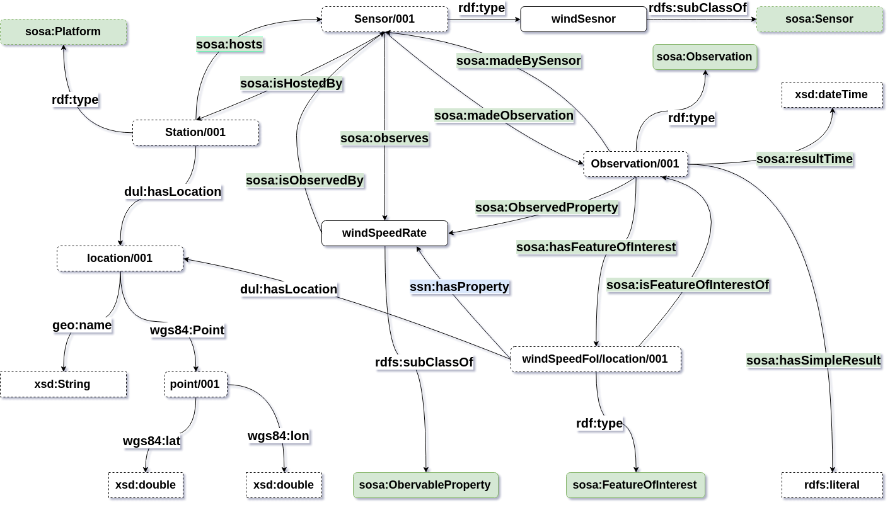

# Semantics2019
## Data Schema and Generator

The dataset which was used in this experiment was created by wrapping the weather data dataset 
[NOAA](https://www.ncdc.noaa.gov/) to RDF using the updated version of 
[SSN ontology](https://www.w3.org/TR/vocab-ssn/).



The java tool for wrapping the NOAA dataset can be found at [1](https://github.com/anhlt18vn/noaa-2-rdf).


## Guidelines for running evaluation.


### Setting Up the Ecosystem

Our system is developed using 4 components. To setup each components we provide guidelines.
1. [Blockchain - Ethereum Cluster](./blockchain/README.md)
2. [IPFS Cluster](./ipfs/README.md)
3. [Redis Cluster](./redis/README.md)
4. [Java Client](./java/README.md)

We deployed the above components on Raspberry Pi Model 3B. The Raspbian OS was used on Rpi.


## Setting up the Experiments

* Clone this repository in <home_dir> ex. /home/pi
* Location for the data should be /home/pi/Dataset

## Run the Experiments

#### Skeleton to Run a Publisher-Consumer Client

java -Xms200m -Xmx650m -cp ./tub.ods.distributed.rdf4led/tub.ods.distributed.rdf4led.1.0-SNAPSHOT.jar tub.ods.rdf4led.distributed.benchmark.{**TASK**} **SMART_CONTRACT_ADDRESS PRE-FUNDED_ADDRESS ETHEREUM_FULL_CLIENT**

**TASK**: Mention the task to carry out the evaluation. example Insertion & Querying.

**SMART_CONTRACT_ADDRESS**: Smart Contract address which is deployed on blockchain network to interact with our Smart Contract Manager Service.

**PRE-FUNDED_ADDRESS**: We provide Ethereum's client address who already has pre-loaded Ethers/Tokens which can be transfered to each client to carry out transactions.

**ETHEREUM_FULL_CLIENT**: The Remote Procedure Client to submit transactions to Blockchain network

### 1. Inserting Linked Sensor Data

```
java -Xms200m -Xmx750m -cp ./tub.ods.distributed.rdf4led/tub.ods.distributed.rdf4led.1.0-SNAPSHOT.jar tub.ods.rdf4led.distributed.benchmark.DistributedTripleIndexTest 0x9F1ef2A6Eee18B512c6BC9825F7eaDD7Fc2d6277 0x0bb88C02096d91aeD3AD33e15CFC240A37d77b92 http://192.168.1.228:8545
```

### 2. Querying Dataset

```
java -Xms200m -Xmx750m -cp ./tub.ods.distributed.rdf4led/tub.ods.distributed.rdf4led.1.0-SNAPSHOT.jar tub.ods.rdf4led.distributed.benchmark.QueryingTest 0x9F1ef2A6Eee18B512c6BC9825F7eaDD7Fc2d6277 0x0bb88C02096d91aeD3AD33e15CFC240A37d77b92 http://192.168.1.228:8545
```
